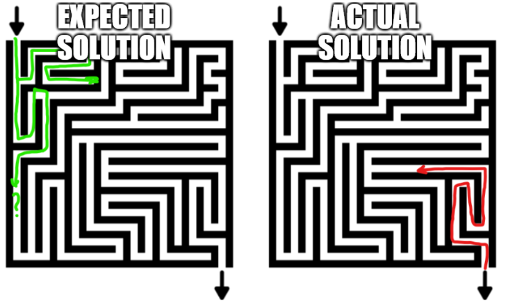
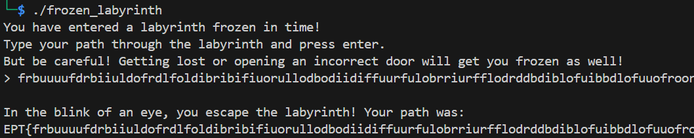

# Frozen Labyrinth
*Author: PEDRO*

## Summary
- First actions
	- Reading the decompiled code
	- Room functions
	- Main function
- Understanding the task
- Solving the puzzle
	- Building the labyrinth
		- Getting the data ready for extraction
		- Extracting the data
	- Finding the path

## First actions
The provided file is an ELF.

Used an online decompiler: https://dogbolt.org (Hex-Rays output). Stored in [decompiled.c](decompiled.c).

### Reading the decompiled code
The file is made out of 625 ```room_xxx()``` functions, and a main.

### Room functions
Example of a ```room_xxx()``` function:
```c
int room_464()
{
  int result; // eax
  char v1; // [rsp+1Fh] [rbp-1h]

  pthread_mutex_lock(&stru_21CA0);
  v1 = getchar();
  TEXT[PTR] = v1;
  result = ++PTR;
  if ( v1 == 100 )
    return pthread_mutex_unlock(&stru_21BD8);
  return result;
}
```
- The ```pthread_mutex_lock(&stru_21CA0)``` freezes the execution of this function as long as the mutex is locked.
- It then reads a character from stdin with  ```v1 = getchar()```.
- If the character is ```d```, it unlocks a second mutex with ```pthread_mutex_unlock(&stru_21BD8)```.
- This second mutex is the one locking the function ```room_459()``` - which follows the same structure.

### Main function
Reading through the ```main``` function:
```c
int __fastcall main(int argc, const char **argv, const char **envp)
{
  int m;
  int k;
  int j;
  int i;

  if ( pthread_mutex_init(&exit_door, 0) )
  {
LABEL_9:
    puts("Setup error...");
    return 1;
  }
  else
  {
    pthread_mutex_lock(&exit_door);
    for ( i = 0; i <= 4; ++i )
    {
      for ( j = 0; j <= 4; ++j )
      {
        for ( k = 0; k <= 4; ++k )
        {
          for ( m = 0; m <= 4; ++m )
          {
            if ( pthread_mutex_init(&DOORS + 125 * i + 25 * j + 5 * k + m, 0) )
              goto LABEL_9;
            pthread_mutex_lock(&DOORS + 125 * i + 25 * j + 5 * k + m);
            if ( pthread_create(
                   &tid[125 * i + 25 * j + 5 * k + m],
                   0,
                   (void *(*)(void *))*(&ROOMS + 125 * i + 25 * j + 5 * k + m),
                   0) )
            {
              goto LABEL_9;
            }
          }
        }
      }
    }
    puts("You have entered a labyrinth frozen in time!");
    puts("Type your path through the labyrinth and press enter.");
    puts("But be careful! Getting lost or opening an incorrect door will get you frozen as well!");
    printf("> ");
    pthread_mutex_unlock(&DOORS);
    pthread_mutex_lock(&exit_door);
    puts("\nIn the blink of an eye, you escape the labyrinth! Your path was:");
    printf("EPT{");
    printf("%s", TEXT);
    puts("}");
    return 0;
  }
}
```
- There is an *exit door*: ```pthread_mutex_lock(&exit_door)```
- The program locks 625 mutexes with ```pthread_mutex_lock(&DOORS + 125 * i + 25 * j + 5 * k + m)```
- The program creates 625 threads with ```pthread_create(&tid[125 * i + 25 * j + 5 * k + m], 0, (void *(*)(void *))*(&ROOMS + 125 * i + 25 * j + 5 * k + m), 0)```
- The flag seems to be some kind of "path".

## Understanding the task
Helped with the challenge name, it appears:
- We are in a 4-dimension labyrinth with 625 rooms (5x5x5x5).
- Rooms are *threads*, and are separated by *doors*.
- Doors are *mutexes*, and are unlocked by a *key*.
- *Keys* are read from the user's input.

In other words: **the task is to find the sequence of keys to the ```exit_door```**.

## Solving the puzzle
And as I learnt as a child, the best way to solve a maze is to start from the end:



So, we need two things here:
- Build the labyrinth
- Find the path

### Building the labyrinth
The different ```room_xxx()``` functions hold the information we need:
- The mutex locking the thread.
- The key to unlock other mutexes.

The objective here is to get the data ready for extraction, and then extract it.

#### Getting the data ready for extraction
Using Visual Studio Code to clean the [decompiled.c](decompiled.c) file to be able to retrieve the relevant data.

I won't explain the whole cleaning process, but for example here is how to remove all the comments:
- Select any ```//```
- Press ```Ctrl + F2``` to select all occurrences
- Press ```Left``` and ```Enter``` to have all comments on a new line
- Press ```Ctrl + L``` to select the whole lines
- Press ```Del``` to remove it

Similar technique has been used to get the functions flattened. Result can be seen in [rooms.c](rooms.c).
```c
...
room_591(){  pthread_mutex_lock(&stru_23078);  TEXT[PTR] = getchar();  return (unsigned int)++PTR;}
room_592(){  int result;   char v1;   pthread_mutex_lock(&stru_230A0);  v1 = getchar();  TEXT[PTR] = v1;  result = ++PTR;  if ( v1 == 114 )    return pthread_mutex_unlock(&stru_230C8);  return result;}
...
```

#### Extracting the data
Done in [create_maze.py](create_maze.py):
```python
import json 

lines = open('./rooms.c', 'r').readlines()

rooms = {}

for line in lines:
    # Example line:
    # room_550(){  int result;   char v1;   pthread_mutex_lock(&stru_22A10);  v1 = getchar();  TEXT[PTR] = v1;  result = ++PTR;  if ( v1 == 117 )    result = pthread_mutex_unlock(&stru_22AD8);  if ( v1 == 111 )    return pthread_mutex_unlock(&stru_22628);  return result;}
    

    room_number = line.split('(')[0]
    locking_door = line.split('pthread_mutex_lock(&')[1].split(')')[0]
    
    doors = {}
    for unlocked_room in line.split('if ( v1 == ')[1:]:
        key = int(unlocked_room.split(' )')[0])
        door = unlocked_room.split('pthread_mutex_unlock(&')[1].split(')')[0]
        
        doors[door] = key
        print(f'\t{key} {chr(int(key))} - {door}')
    print(room_number, locking_door)

    room = { "locking_door_name": locking_door, "doors": doors }
    rooms[room_number] = room


with open('./rooms.json', 'w') as g:
    json.dump(rooms, g, indent=4)
```

The output is in [rooms.json](rooms.json).

### Finding the path
#### N-th room
Let's start with the last room: ```room_624```:
```json
"room_624": {
        "locking_door_name": "stru_235A0",
        "doors": {
            "exit_door": 114
        }
    }
```
```room_624``` is locked by the door ```stru_235A0```. 

#### N-1th room
We can find that door in ```room_599```: door ```stru_235A0``` is unlocked from ```room_599``` using key ```105```.
```json
"room_599": {
        "locking_door_name": "stru_231B8",
        "doors": {
            "stru_235A0": 105
        }
    }
```
```room_599``` is locked by the door ```stru_231B8```. 

#### Generalizing
The following script automates that process: [find_path.py](find_path.py)
```python
import json

with open('./rooms.json', 'r') as g:
    rooms = json.load(g)

path = chr(114) # Key to exit_door
start_room = 'room_624' # Room that leads to the exit_door

current_room = start_room

while('monkey'):
    locking_door = rooms[current_room]['locking_door_name']
    found = False
    for room in rooms.keys():
        for door in rooms[room]["doors"].keys():
            if door == locking_door:
                current_room = room
                path += chr(rooms[room]["doors"][door]) 
                print(path)
                found = True

    if found: continue
    
    print(f'No door seems to unlock the current room: {current_room}')
    break

print()
print(f'Final path found: {path[::-1]}')
```
The final sequence of keys needs to be reversed (since we are going through the maze in reverse order).


